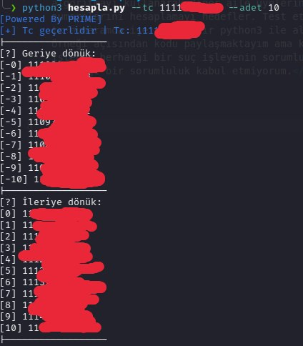
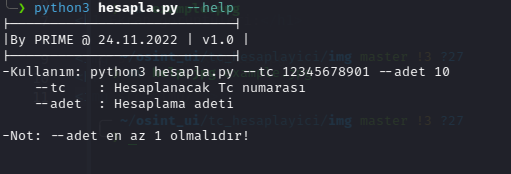

 # Tc hesaplayıcı

<h1>Ne işe yarar?</h1>
<p>Ülkemizde atana tc kimlik numaraları belirli bir algoritma ile atanmaktadır bu basit kod örneğide bu algoritmayı kullanarak diğer aile üyelerinin tc numaralarını hesaplamayı hedefler. Test ettiğim kendi tc numaramda işe yaramıştır python3 ile algoritma örneği açısından kodu paylaşmaktayım ama kod ile işlenen herhangi bir suç işleyenin sorumluluğundadır herhangi bir sorumluluk kabul etmiyorum.</p>


<h1>Ekran görüntüleri:</h1>

<h2>Örnek kullanım:</h2>

<hr>
<h2>Help menüsü:</h2>


<br>
<h1>Bağımlılıklar:</h1>

```sh
python3 -m pip install colorama argparse  #linux & Macos
```
```sh
pip install colorama argparse #windows
```