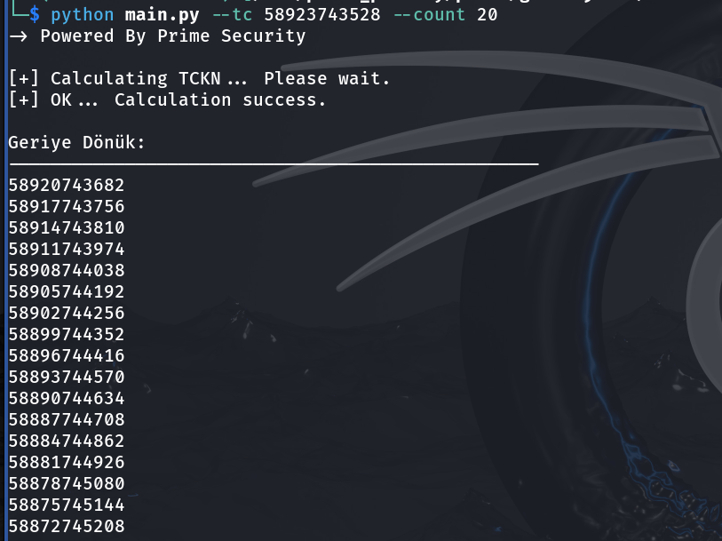

 # TCKN-Calculator

# Ne İşe Yarar ?

Ülkemizdeki bireylere atanan TCKN numrası rastgele olarak atanmıyor, matematiksel olarak belli kurallara dayanarak atandığı için bunu python3 dili ile otomatik olarak hesaplamasını sağlayan bir koddur. MIT lisansı altında dağıtılmaktadır.


## Özellikleri:

-> Otomatik olarak TCKN geçerliliğini kontrol eder
-> İstenen adette ileri ve geriye yönelik hesaplama yapar
-> Python3.x projeleri için TCKN_Calculator dizini bir kütüphanedir istendiği an koda entegre edilebilir 


## Bağımlılıkların Kurulması:

```sh
python3 -m pip install argparse  #linux & Macos
```
```sh
pip install argparse #windows
```


## Örneklerden Ekran Görüntüsü 

-> Aşşağıdaki Örneklerde Kullanılan TCKN numarası herhangi bir kişiye ait değildir matematiksel olarak geçerli ama rastgele üretilmiştir.


### Geçerli Bir TCKN için:




### Geçersiz Bir TCKN için:


